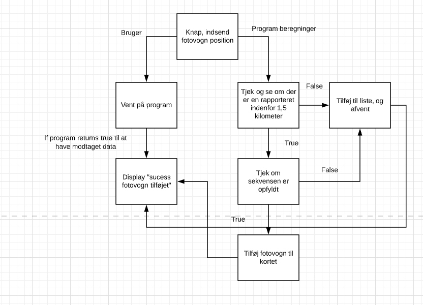
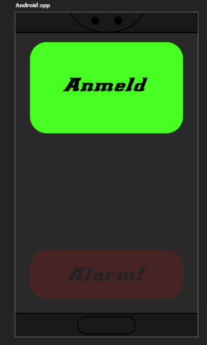
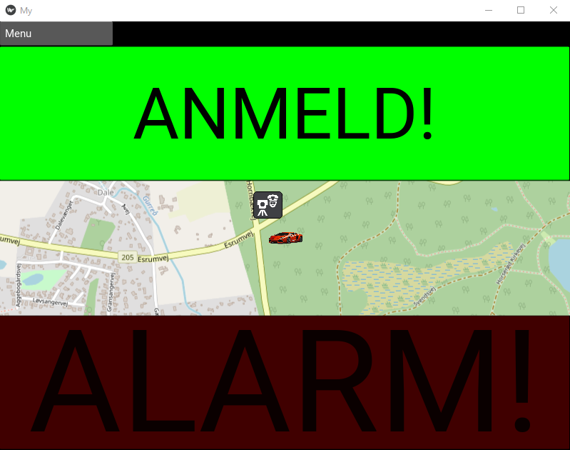
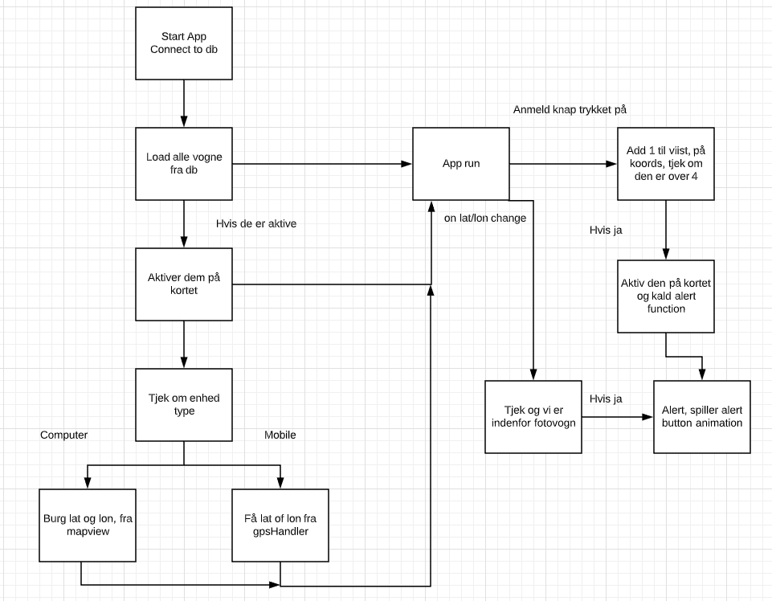
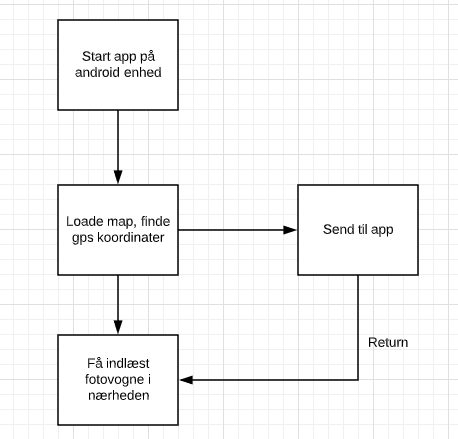

# Eksamensprojekt
3.F eksamensprojekt (Mathias R-D, Marcus L og Emil A)

**Hvad har vi lavet?**
>Vi har valgt at lave en app, der kan bruges til android mobiler og styresystemer som skal sørge for at mindske chancen for bøder hos bilister. Dette har vi valgt at gøre ved at lave en app som kan fortælle hvor og hvornår der er fotovogn.

**Hvordan fungerer det?**
>Appen fungerer ved at live update gps singalet fra bilister der bruger appen, og bilisterne kan så klikke på en anmeld knap når de ser en fotovogn ved deres nuværende placering. Dette vil blive registreret i en database der holder styr på koordinaterne og på hvor mange der har klikket på anmeld knappen på et givent koordinat. Når antallet af registreret klik for et givent koordinat er opfyldt for et hvis antal, så vil fotovognen blive vist på kortet, og en Alarm vil gå i gang, hvis du befinder dig i området. Flowchart der viser hvad der sker når appen booter up og hvordan anmeld systemet fungerer: Knapper: 

**Hvad var vores originale tanker?**
>Vores originale design på appen vil have set ud således, som er et simpelt design der ikke skaber forvirring og vil være nemt at bruge imens man køre bil, og ikke kræver for meget opmærksomhed af bilisten: Original app ide: 

>**Her er hvordan appen ser ud på computer:** 

>Her er også et billede af vores fulde flowchart, til at se de simpleste funktioner ved programmet det minder om det originale, men dette er lavet efter for at vise hvor vi kom fra, og hvad vi gik til. Men alle grundstene er der stadig: 

**A few cool features**
>Derudover har vores app en menu bar. Her har man adgang til flere forskellige funktioner. Her har man mulighed for at zoome ind og ud på kortet samt reset til standard zoom tilstand. Derudover kan vi fremvise brugen af appen ved 4 ekstra funktioner der er lavet i menuen, hvor man kan increase og decrease longtitude og altitude, for at flytte ens position. Vi kan på denne måde vise at man kan være hvor som helst og registrere en fotovogn.

>Når appen åbnes autoloader den alle fotovogne der er anmeldt af brugere og vil blive vist på kortet, selvom man har været offline. Opstart: 

>Udover det, så tjekker den også hvorvidt man nærmer sig en fotovogn eller ej, og starter selv alarm knappen

**Hvad kunne vi have gjort bedre?**
>Der er dog lavet nogle få ændringer hvor knapperne er blevet flyttet lidt og der nu er et kort vist i midten af skærmen hvor man kan se allerede registret fotovogne.

>Der er dog stadig ting der kan forbedres og skal laves før Appen er fuldt funktionel. Appen kan kun registrere specifikke koordinater og har derfor ikke vores ønskede radius som originalt var tænkt. Derudover kan programmet ikke køre på en android telefon endnu, da der er kommer nogle udfordringer i vejen for at vi kunne bruge ”Android Module”.
